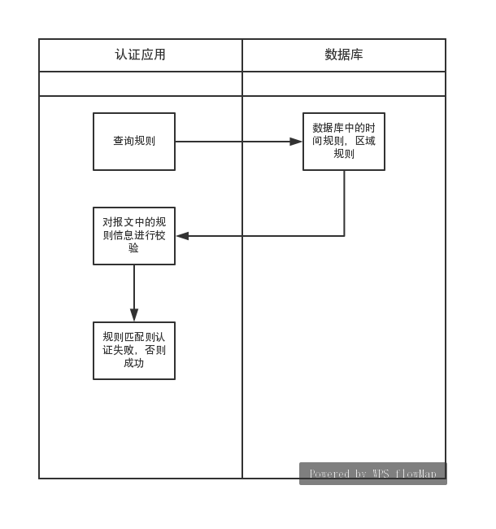

#背景：
线上有一系列的规则，需要校验，只要有规则不通过则认证失败，否则认证成功；

#实现    
该项目是在策略模式的基础上，使用动态加载+反射扫描某个包下的规则，架构搭建完之后，后续的编程只需要在特定的报下，实现子类就能实现规则的自动匹配了。

在 application 中，通过扫包+反射的方式动态代理创建了 service.buzi 包下规则的认证类，并执行其中的 auth() 方法。而目前只有一个实现类 RuleAuth，其中，功能主要是规则的认证。而 RuleAuth 在 init() 方法中，又通过对 service.rule 包下的java文件进行扫面，并通过反射创建对象后执行 verify() 方法，实现对规则的验证。

#目的
该模块是在策略模式的基础进行优化，现在编程。如果需要对某些规则进行校验的话，就只需要在 service.rule 包下，创建对应的类并实现 Rule 即可。如果需要添加多的认证时，也只需在 service.buzi.impl 包下，创建对应的类并实现 BusiAuth即可。

从而实现代码解耦。